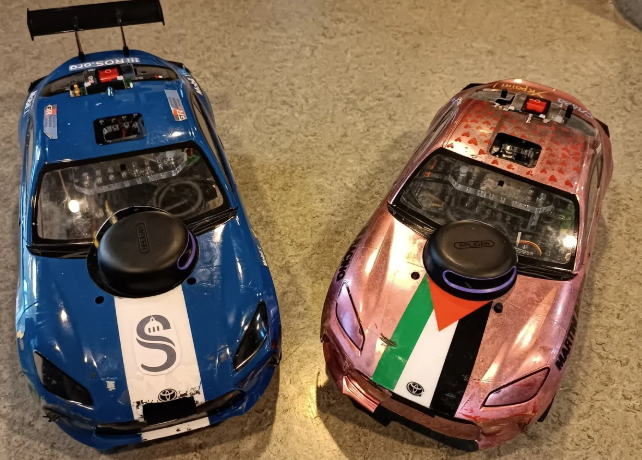

# Autonomous RC Car Race 2025

## Project Overview

This project, developed by Sorbonne University students, aims to create autonomous RC cars capable of navigating a track and avoiding obstacles. The cars are designed for the ENS-organized CoVAPSy (*Course Voiture Autonome Paris-Saclay*) race.

For the 2025 race, we participated with two identical cars. This year, we transitioned from ROS to ROS2 with a focus on building a clean and modular code architecture, enabling the implementation of more advanced navigation algorithms.

### Code Structure

Our codebase is divided into two main components:

- **[Low-Level Package](https://github.com/SU-Bolides/low_level_ros2):** Handles sensor data acquisition, processing, and publication.
- **[High-Level Package](https://github.com/SU-Bolides/high_level_ros2):** Designed for implementing navigation algorithms and higher-level functionalities.

### Simulation and Visualization

We also developed a bridge between ROS2 and Webots simulation to facilitate testing and visualization:

- **[Simulation and Visualization](https://github.com/SU-Bolides/simulation_ros2):** Contains Rviz2 and Webots configurations for simulating and visualizing the car's behavior in a virtual environment.

### Additional Resources

This repository includes:

- **Resources:** The [ressources](ressources/) folder contains essential materials for the project.
- **STM32 Code:** The [CoVAPSy_STM32](CoVAPSy_STM32/) directory houses the STM32 microcontroller code, which connects the car's sensors to the Raspberry Pi.

