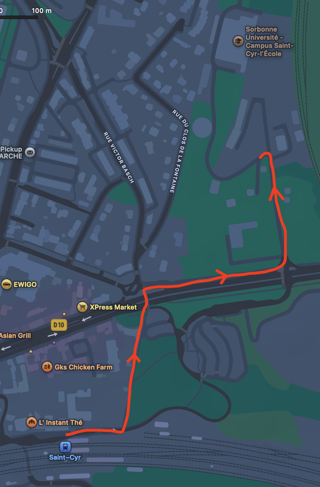
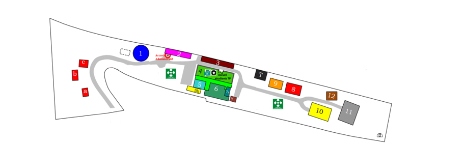
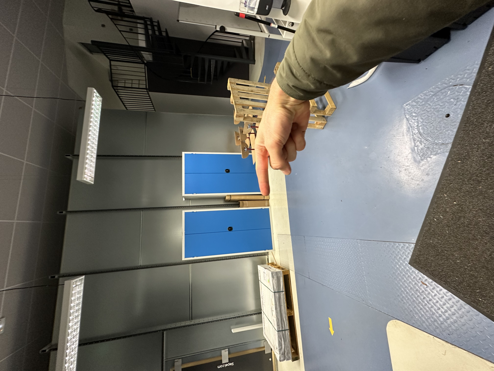
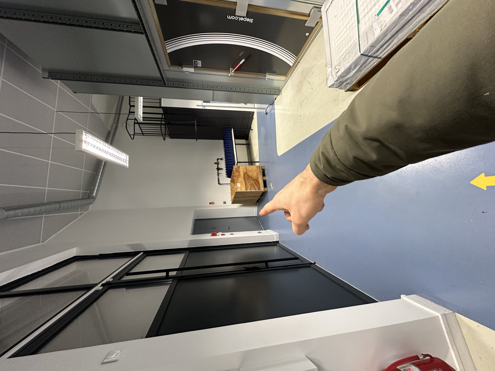
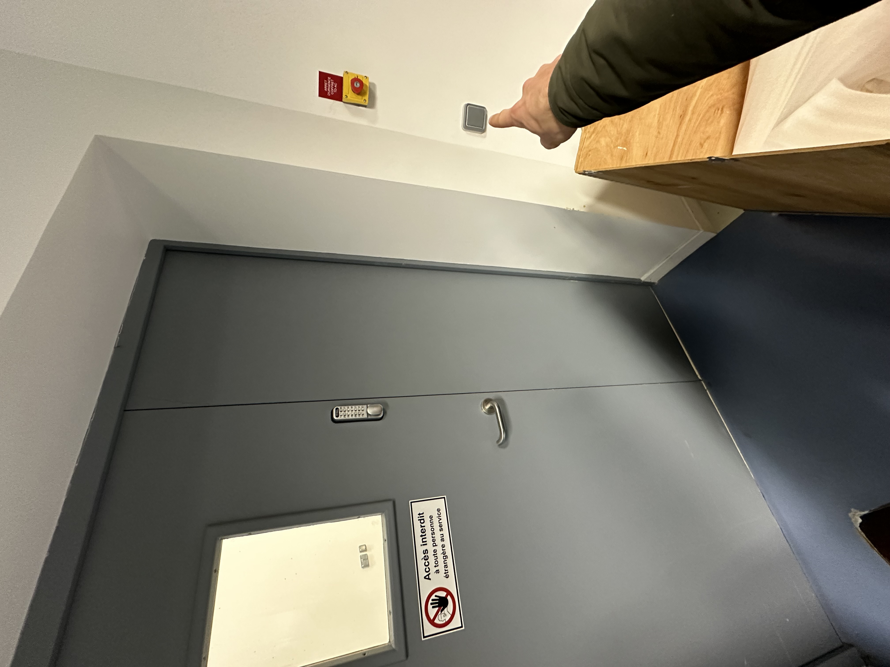

# Going to Saint-Cyr to try out the car on track.

Sorbonne Universite is lucky to have a campus, located in the town of Saint-Cyr-l'Ecole, where there is a dedicated room with a racetrack set up to allow us to carry out real life testing on a real track.

The only downside is that the track is quite small, which makes it tricky to navigate due to the relatively low steering lock angle of the car. Do note that the racetrack at ENS Saclay is a fair bit wider, which makes it much more forgiving to any navigation or localisation errors.

## Getting to Saint-Cyr 

Take your favourite mode of transportation to station Saint-Cyr-l'Ecole. It is common to take the RER C, from Gare d'Austerlitz, or the Ligne N, from Gare Montparnasse. It will take you around an hour to get there, so double check that you haven't forgotten anything important. 

Once there, walk the path marked below to get to the Sorbonne University campus. 

Once at the unmistakably Sorbonne door, enter the code or scan your badge, and then walk all the way to building 11. Don't forget to pass by building 2, the "accueil", to notify of your presence. 

Once you've reached building 11, named "Jacques Julien", scan your badge at the door, then follow the below directions: 

## Setting up at Saint-Cyr. 

Once there, you can set up your car as usual. There should be a router there, SSID R15-AF66, which you can use if you don't want to use your phone's hotspot. 

For general purpose internet browsing, there is the Eduroam network which you can connect to the same as you would Jussieu's eduroam.

Feel free to modify the track layout to test out different configurations.
