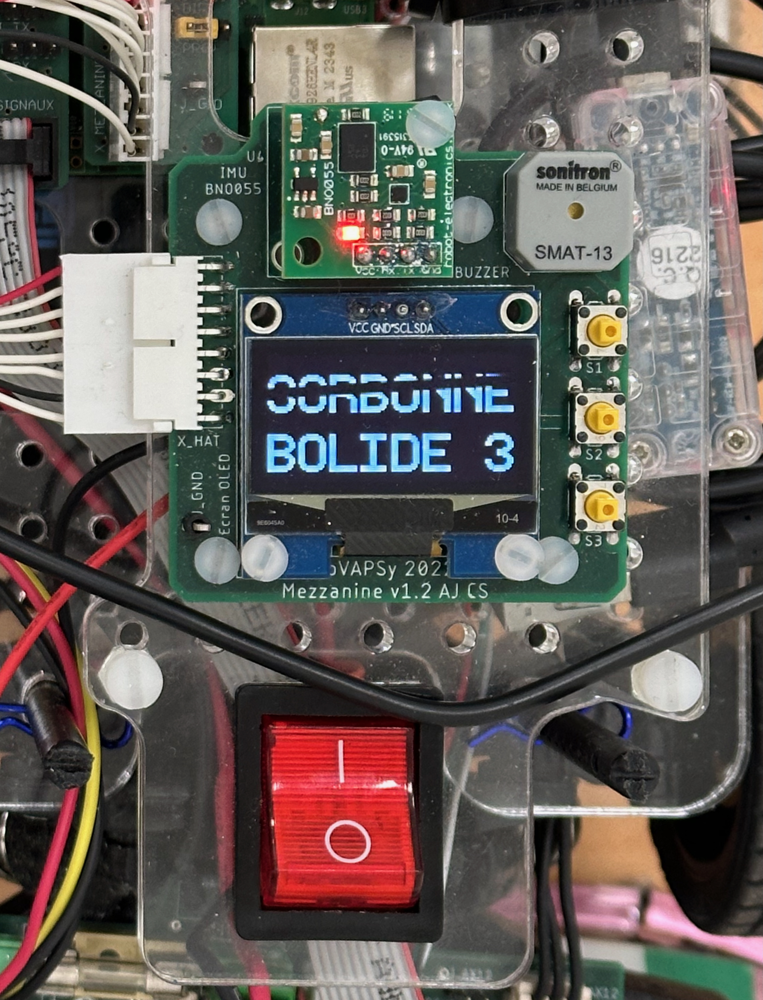

# 🚀 Quick Start Guide

You have the car, and want to get it up and running. 

## Requirements

You need a mobile phone with hotspot capability, a computer preferably running Ubuntu with ROS installed, and a car equippped with a fully charged battery. Ensure that all the connections are safe and sound, and place the car on an elevated surface to lift the wheels off the ground, preventing it from taking off in case of a mishap.
This guide assumes you have already configured everything to work together. For a more in detail guide, check out the Operation section

## Procedure

1. Turn on power to the car systems by setting the main red button to on. There should be a long beep, and the screen should stay off.
2. Using a long pin, press the Raspberry Pi's power button, through the fan. The Pi's LED should turn green, and the fan should start spinning.


3. Turn on your phone's hotspot. On iPhones, staying on the Personal Hotspot page is recommended, as well as disconnecting any other devices from the Hotspot. The car should connect to the hotspot within 30 seconds to a minute.

4. Press the lowest button of the three buttons situated to the right of the screen. There should be a long beep, and the screen should turn on.



5. On your personal computer, connect to the phone hotspot and ping bolide1.local (or bolide3.local). You should see the following printouts appear:


```
64 bytes from 192.10.1.8: icmp_seq=0 ttl=116 time=10.720 ms
```

NOTE: the IP address will vary from connection to connection. Here, the car's IP address is 192.10.1.8. 

6. You can now SSH into the car, launch the docker container and attach to it. You are now free to execute whatever you want to.

```
ssh bolide1@bolide3.local
```

```
docker start bolide_container
docker attach bolide_container
```

To make a new terminal, run the following command after ssh-ing to the car: 
```
docker exec -it bolide_container /bin/bash
```
